# 🛒 Brazilian E-Commerce Analytics — End-to-End Power BI Project

An end-to-end Business Intelligence solution built on the [Brazilian E-Commerce Public Dataset by Olist](https://www.kaggle.com/datasets/olistbr/brazilian-ecommerce), covering the full pipeline from raw CSV data to a deployed, secured, and monitored Power BI solution.


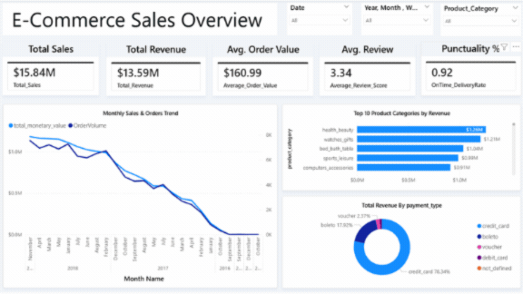


---

## 📖 Table of Contents

1. [Project Overview](#-project-overview)
2. [Tech Stack](#-tech-stack)
3. [Dataset](#-dataset)
4. [Project Architecture](#-project-architecture)
5. [Data Cleaning & Transformation](#-data-cleaning--transformation)
6. [Data Model (Star Schema)](#-data-model-star-schema)
7. [DAX Measures](#-dax-measures)
8. [Report Design — 6 Pages](#-report-design--6-pages)
9. [Power BI Service — Deployment & Governance](#-power-bi-service--deployment--governance)
10. [Key Business Questions Answered](#-key-business-questions-answered)
11. [Repository Structure](#-repository-structure)
12. [How to Use This Project](#-how-to-use-this-project)
13. [Limitations & Future Improvements](#-limitations--future-improvements)
14. [Author](#-author)

---

## 🎯 Project Overview

This project simulates a real-world business intelligence engagement for an e-commerce marketplace. It takes the raw, multi-table Olist dataset and transforms it into a governed, decision-ready analytics solution — not just a report, but a full BI lifecycle:

**Raw CSVs → Power Query Cleaning → Star Schema Model → DAX Measures → Interactive Report → Power BI Service Deployment, Security & Monitoring**

The goal was to demonstrate practical, job-ready skills across the entire Power BI stack: data cleaning, dimensional modeling, DAX calculation design, UX/report design, and Power BI Service administration (gateways, refresh, RLS, apps, alerts).

---

## 🧰 Tech Stack

| Layer | Tool |
|---|---|
| Data Source | CSV files (Olist Brazilian E-Commerce dataset, Kaggle) |
| ETL / Transformation | Power Query (M) |
| Data Modeling | Power BI Desktop (Star Schema) |
| Calculations | DAX |
| Reporting / Visualization | Power BI Desktop |
| Deployment & Governance | Power BI Service (Workspaces, Gateway, RLS, Apps) |

---

## 📦 Dataset

The [Olist Brazilian E-Commerce dataset](https://www.kaggle.com/datasets/olistbr/brazilian-ecommerce) contains real, anonymized order data from a Brazilian marketplace (2016–2018), spanning customers, orders, order items, payments, reviews, products, sellers, and geolocation — across **9 relational CSV files**.

---

## 🏗️ Project Architecture

```text
CSV Data Sources (9 tables)
        ↓
   Power Query (M)  →  Cleaning, typing, dedup, incremental refresh prep
        ↓
   Star Schema Data Model  →  orders + order_items as dual fact tables
        ↓
        DAX  →  20+ measures across sales, logistics, sentiment
        ↓
   Power BI Report  →  6-page interactive analytical report
        ↓
   Power BI Service  →  Gateway, refresh, dashboard, alerts, RLS, App
        ↓
   Authorized Business Users (Executives / Sellers)
```
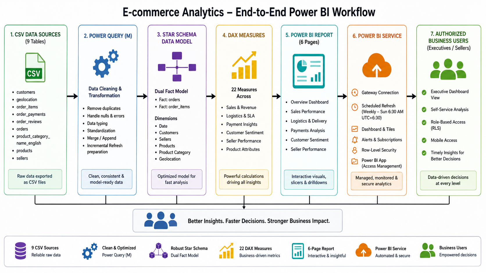


---

## 🧹 Data Cleaning & Transformation

Performed entirely in Power Query (M). Highlights:

- **Type enforcement** — IDs as Text, financial fields as Decimal Number, timestamps as Date/Time.
- **Intentional null handling** — blank fulfillment dates (`order_approved_at`, `order_delivered_customer_date`) and blank product categories were **preserved**, not deleted, because they represent real business states (pending/canceled/lost orders).
- **Deduplication** — duplicate `review_id` records removed to prevent inflated review metrics.
- **Geolocation grouping** — repeated lat/long pairs grouped by zip-code prefix for cleaner map visuals.
- **Localization** — Portuguese product categories mapped to English (e.g. `beleza_saude` → `health_beauty`).
- **Incremental Refresh prep** — `RangeStart` / `RangeEnd` parameters applied to `order_purchase_timestamp`.

📄 Full details: [`Data_Cleaning.md`](Documentation/Data_Cleaning.md)

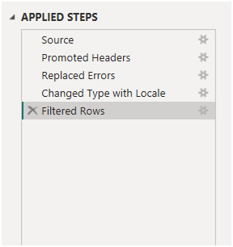

---

## 🗂️ Data Model (Star Schema)

A **multi-fact star schema** preserving the dataset's natural business grains instead of flattening everything into one table.

| Table | Grain | Role |
|---|---|---|
| `orders` | 1 row / order | Order lifecycle & delivery |
| `order_items` | 1 row / line item | Sales, pricing, freight, sellers |
| `order_payments` | 1 row / payment | Payment behavior |
| `order_reviews` | 1 row / review | Customer satisfaction |
| `customers`, `sellers`, `products`, `product_category_name_english`, `geolocation`, `DateTable` | Descriptive dimensions | Filtering context |

Relationships are primarily **single-direction 1:many**, with one deliberate bidirectional relationship (`orders` ↔ `order_items`) for a specific analytical requirement.

📄 Full details: [`Data_Model.md`](Documentation/Data_Model.md)

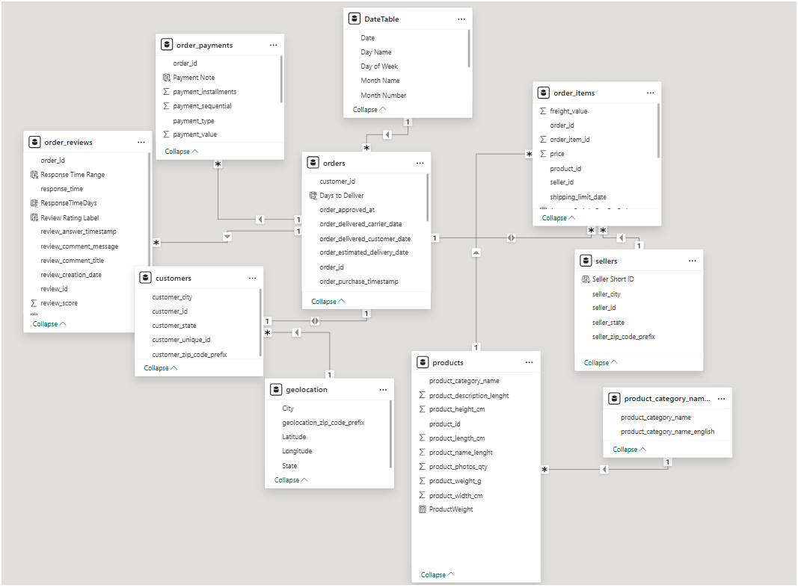


---

## 🧮 DAX Measures

20+ measures organized into four groups:

- **Sales & Revenue** — Total Revenue, AOV, Freight Ratio, Avg Payment Installments
- **Logistics & SLA** — Days to Deliver, SLA Performance, On-Time Rate by Seller, Avg Days Late
- **Customer Sentiment** — Average Review Score, % 5-Star / % 1-Star, Response Time
- **Dimension Helpers** — Seller Short ID, Product Weight conversions

Design principles followed: separating row-level logic from aggregation, `DIVIDE()` for safe ratios, preserving meaningful blanks, and reusing measures to keep the model maintainable.

📄 Full details: [`DAX_Measures.md`](Documentation/DAX_Measures.md)

---

## 📊 Report Design — 6 Pages

The report follows a progressive analytical journey:

> **Business Overview → Sales & Geography → Logistics → Customer Satisfaction → Seller Analysis → Seller Details**

| # | Page | Focus |
|---|---|---|
| 1 | **E-Commerce Sales Overview** | Executive KPIs, monthly trend, top categories, payment mix |
| 2 | **Sales & Geographic Performance** | Revenue by state, category detail table, installment analysis |
| 3 | **Logistics & Supply Chain Operations** | Delivery time, SLA gauge, shipping cost vs weight |
| 4 | **Customer Satisfaction & Seller Rating** | Review distribution, delivery-time impact on reviews, top/bottom sellers |
| 5 | **Seller Tooltips** | Seller's ID |
| 6 | **Seller's Details** | Drill-through seller scorecard, reviews, delivery vs SLA |

📄 Full details: [`Report_Design.md`](Documentation/Report_Design.md)

### Page 1 — E-Commerce Sales Overview
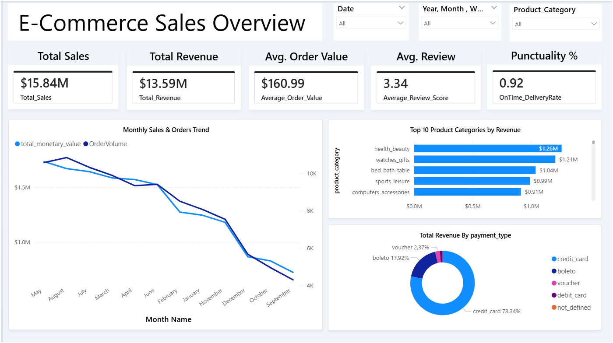

### Page 2 — Sales & Geographic Performance
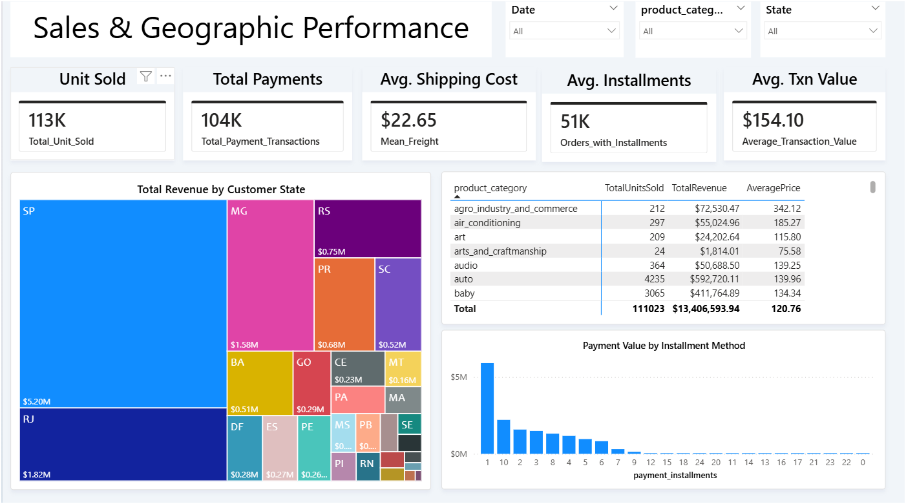

### Page 3 — Logistics & Supply Chain Operations
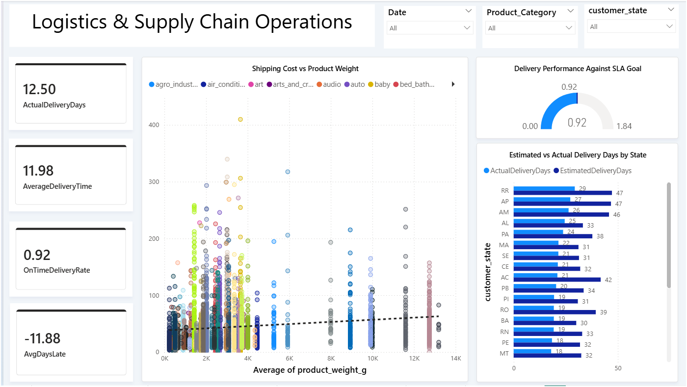

### Page 4 — Customer Satisfaction & Seller Rating
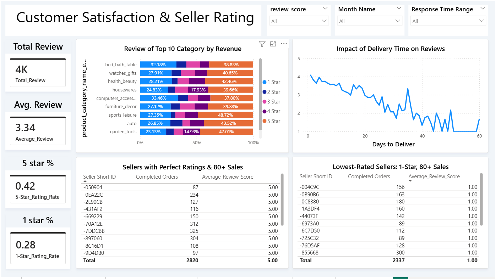

### Page 5 — Seller Tooltips
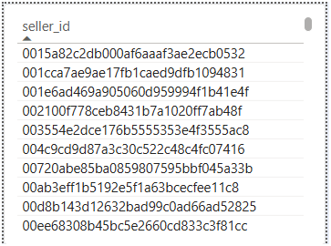

### Page 6 — Seller's Details
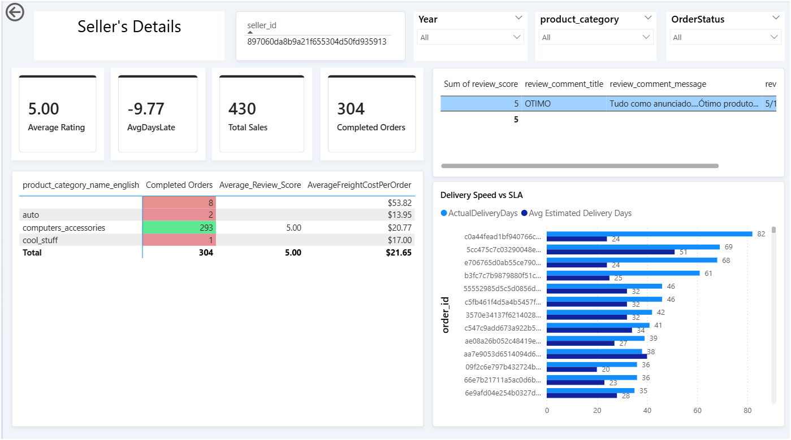

📄 [Download Full Dashboard Screenshots](Olist_ECommerce_Analytics.pdf)

---

## ☁️ Power BI Service — Deployment & Governance

The Desktop report was extended into a fully managed BI solution:

- **Workspace:** `Retail & E-commerce Analytics`
- **Gateway:** On-premises data gateway connecting Service to local CSVs
- **Scheduled Refresh:** Weekly, Sunday 6:30 AM (UTC+6:30)
- **Endorsement:** Semantic model promoted for discovery/reuse
- **Dashboard:** Executive KPI tiles + analytical tiles, with a mobile-optimized layout
- **Alerts:** Total Sales > 120K, Average Review ≤ 3
- **Distribution:** Packaged as a Power BI App, shared with restricted users
- **Row-Level Security:** Seller-level access — each seller sees only their own sales, orders, and reviews via email-to-seller-ID mapping

📄 Full details: [`PowerBI_Service.md`](Documentation/PowerBI_Service.md)

### Role-Level Security (RLS)
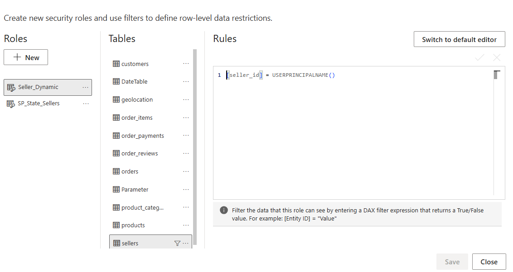

### Scheduled Refresh
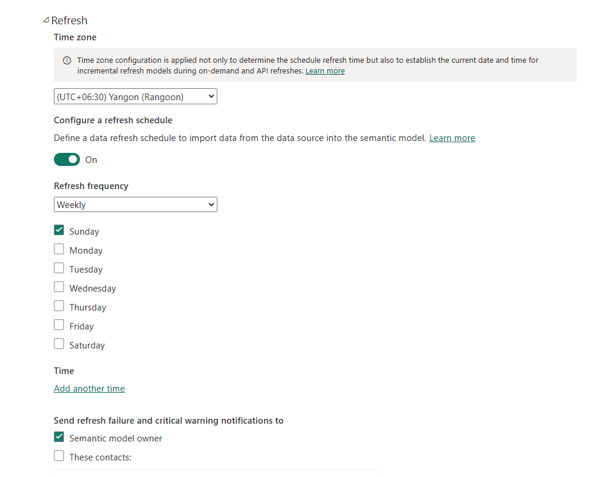

### Web View (Dashboard in Browser)
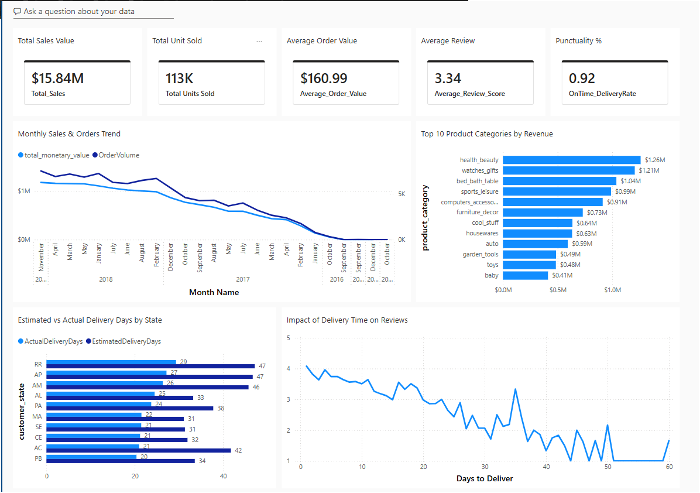

### Published App (Desktop + Mobile Layout)
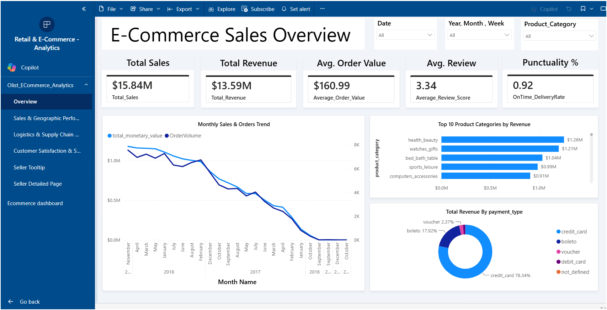

---

## ❓ Key Business Questions Answered

- What are our total sales, revenue, and average order value trends over time?
- Which product categories and states drive the most revenue?
- How is delivery performance tracking against SLA, and where are the delays concentrated?
- Does delivery time affect customer review scores?
- Which sellers are top performers, and which need intervention?
- Can a seller securely view only their own performance data?

---

## 📁 Repository Structure

```text
olist_ecommerce_sales_logistics_powerbi/
 ┣━ Documentation/
 ┃ ┣━ Data_Cleaning.md
 ┃ ┣━ Data_Model.md
 ┃ ┣━ DAX_Measures.md
 ┃ ┣━ PowerBI_Service.md
 ┃ ┗━ Report_Design.md
 ┣━ PowerBI/
 ┃ ┗━ Sales_Analytics.pbix
 ┣━ assets/
 ┃ ┣━ Page1.png
 ┃ ┣━ Page2.png
 ┃ ┣━ Page3.png
 ┃ ┣━ Page4.png
 ┃ ┣━ Page5.png
 ┃ ┣━ Page6.png
 ┃ ┣━ applied_steps.png
 ┃ ┣━ banner_overview.gif
 ┃ ┗━ project_architecture.png
 ┣━ data/
 ┃ ┣━ olist_customers_dataset.csv
 ┃ ┣━ olist_geolocation_dataset.csv
 ┃ ┣━ olist_order_items_dataset.csv
 ┃ ┣━ olist_order_payments_dataset.csv
 ┃ ┣━ olist_order_reviews_dataset.csv
 ┃ ┣━ olist_orders_dataset.csv
 ┃ ┣━ olist_products_dataset.csv
 ┃ ┣━ olist_sellers_dataset.csv
 ┃ ┗━ product_category_name_translation.csv
 ┣━ screenshots/
 ┃ ┣━ 01_Executive_Dashboard.png
 ┃ ┣━ 02_Data_Model.png
 ┃ ┣━ 03_Power_Query.png
 ┃ ┣━ 04_DAX.png
 ┃ ┣━ 05_Drillthrough.png
 ┃ ┣━ 06_Drilldown.png
 ┃ ┣━ 07_Tooltip.png
 ┃ ┣━ 08_RLS.png
 ┃ ┣━ 09_Refresh.png
 ┃ ┣━ 10_Web_View.png
 ┃ ┗━ 11_App.png
 ┣━ Olist_ECommerce_Analytics.pdf
 ┗━ README.md
```

---

## 🚀 How to Use This Project

1. Download the dataset from [Kaggle — Olist Brazilian E-Commerce](https://www.kaggle.com/datasets/olistbr/brazilian-ecommerce).
2. Open `Retail_Ecommerce_Analytics.pbix` in Power BI Desktop.
3. Point the Power Query data sources to your local CSV folder.
4. Refresh the model.
5. Explore the 6 report pages, or review the `/Documentation` folder for the full design rationale behind each layer.

---

## 🔭 Limitations & Future Improvements

- Currently sourced from static CSVs — a production version would move to a SQL/cloud data warehouse.
- More granular RLS roles and role management.
- CI/CD and source-control integration for the Power BI deployment pipeline.
- Additional KPI alerts and refresh monitoring.

---

## 👤 Author

**Pyae Khant Kyaw**
[LinkedIn](https://www.linkedin.com/in/pyae-khant-kyaw-591726390/)

## 📊 Source Data

[Brazilian E-Commerce Public Dataset by Olist](https://www.kaggle.com/datasets/olistbr/brazilian-ecommerce) (Kaggle)

## 🚀 Check Out End-to-End Business Analytics with SQL, Python & Power BI 
[GitHub Repository](https://github.com/pyaekhantkyaw/saleops_business_analysis.git)
